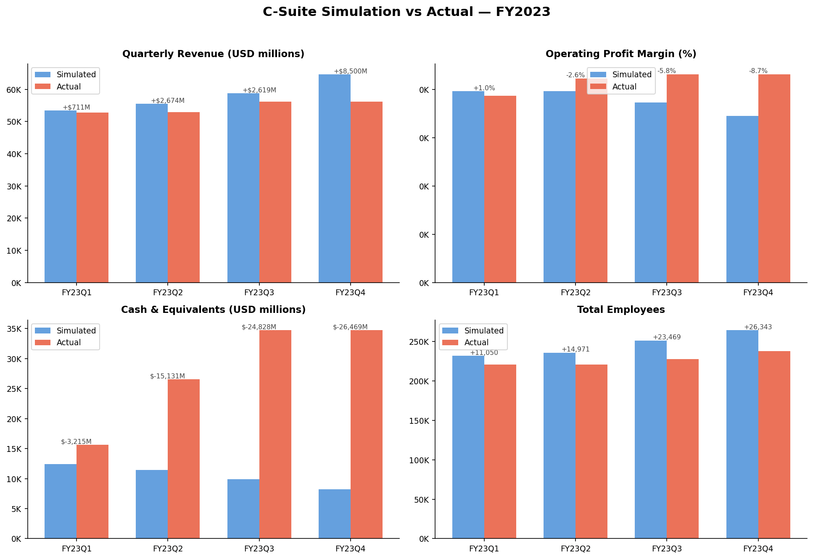
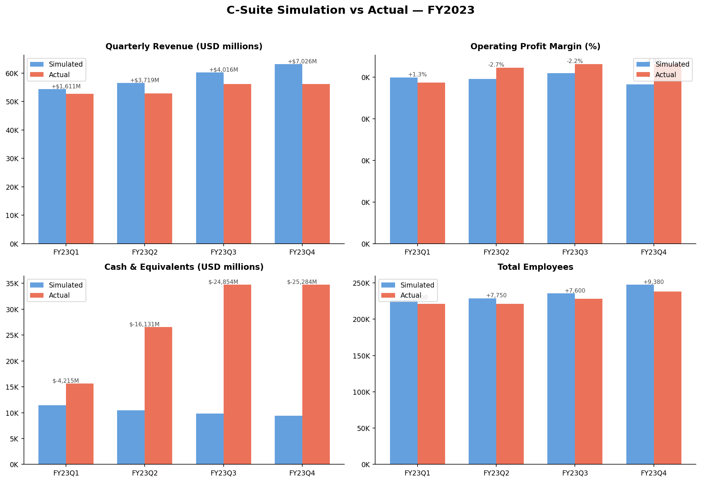
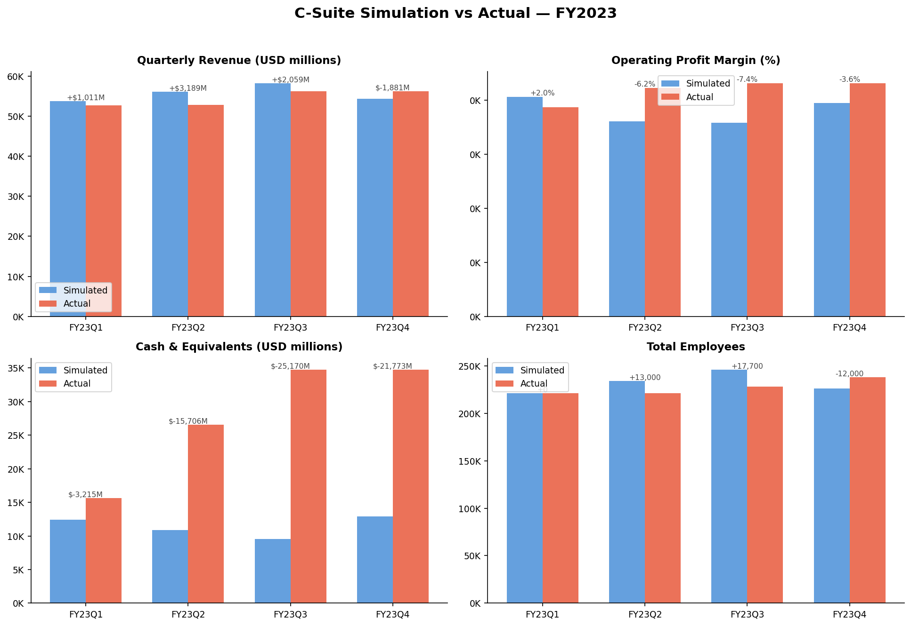
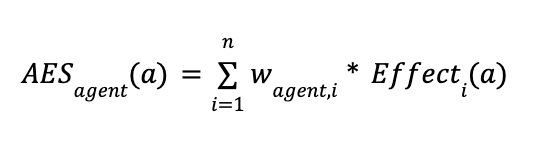
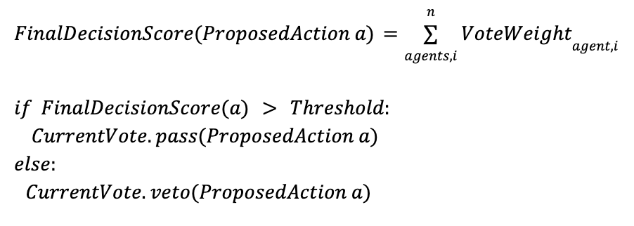

# C-Suite
### *Do we actually need human executives?*

A SIGBOVIK 2026 research project that simulates a full corporate C-suite using a panel of LLM agents, runs them through a real company's fiscal year, and compares their strategic decisions and simulated outcomes against what the actual leadership team did.

The simulation initializes from a real company's FY22Q4 financial state, then runs four quarters (FY23Q1–Q4). Each quarter, a board of ten AI Executive (AIE) agents, each embodying a distinct C-suite role, reviews the company's current state, proposes strategic actions, votes on them, and updates the company state based on the approved decisions.

At the end, simulated outcomes (revenue delta, profit margin, cash, headcount) are compared against what the real company actually produced.

Note that this is a very, *very* satirical take on the latest trend in tech: job automation.

## Results

The simulation seeds from real FY22Q4 financial data. Each subsequent quarter uses only the previous quarter's simulated end state - no real FY2023 data is used during the simulation. The AIE board operates entirely on its own compounding decisions after the seed.

Each quarter's AIE board received the simulated financial state and external market context (*qualitative signals derived from real FY22Q4 documentation, then fed to Claude*) and made independent strategic decisions.

### Baseline - standard board

| Quarter | Revenue Sim | Revenue Actual | Delta |
|---------|------------|---------------|-------|
| FY23Q1  | $53,458M   | $52,747M      | +$711M |
| FY23Q2  | $55,531M   | $52,857M      | +$2,674M |
| FY23Q3  | $58,808M   | $56,189M      | +$2,619M |
| FY23Q4  | $64,688M   | $56,189M      | +$8,500M |

| Quarter | Op. Margin Sim | Op. Margin Actual | Delta |
|---------|---------------|------------------|-------|
| FY23Q1  | 39.6%         | 38.7%            | +1.0% |
| FY23Q2  | 39.7%         | 42.3%            | −2.6% |
| FY23Q3  | 37.3%         | 43.2%            | −5.8% |
| FY23Q4  | 34.5%         | 43.2%            | −8.7% |

| Quarter | Cash Sim  | Cash Actual | Delta |
|---------|----------|------------|-------|
| FY23Q1  | $12,431M | $15,646M   | −$3,215M |
| FY23Q2  | $11,431M | $26,562M   | −$15,131M |
| FY23Q3  | $9,876M  | $34,704M   | −$24,828M |
| FY23Q4  | $8,235M  | $34,704M   | −$26,469M |

| Quarter | Headcount Sim | Headcount Actual | Delta |
|---------|--------------|-----------------|-------|
| FY23Q1  | 232,050      | 221,000         | +11,050 |
| FY23Q2  | 235,971      | 221,000         | +14,971 |
| FY23Q3  | 251,469      | 228,000         | +23,469 |
| FY23Q4  | 264,343      | 238,000         | +26,343 |



### Key findings

**Revenue - consistently overestimated, correct trajectory.** The AIE board tracked revenue direction correctly - both simulated and actual lines trend upward through the year. However the simulation ran progressively hot, with the Q4 delta reaching +$8.5B (+15%). The board's growth-oriented action mix (enterprise sales expansion, AI initiatives, cloud investment) compounded into increasingly optimistic revenue projections as the simulated state drifted further from reality each quarter.

**Operating margin - diverged significantly by year-end.** Q1 margin was close (+1.0%), but the gap widened steadily through the year, reaching −8.7% by Q4. The AI board prioritized growth actions (R&D, hiring, capex) over cost discipline, which is directionally what the real company did, but the simulation didn't capture the operational efficiencies the actual company achieved alongside its investments.

**Cash - largest and most consistent divergence.** The simulation depleted cash steadily across all four quarters, ending Q4 with only $8.2B vs the actual $34.7B - a $26.5B gap. The `ActionLibrary` does not model financing decisions (share buybacks, debt issuance, dividend management) that the actual company actively used to maintain its cash position.

**Headcount - overestimated and compounding.** The simulation consistently hired more aggressively than the real company, with the gap growing from +11K in Q1 to +26K by Q4.

**Strategic direction - correct posture, excessive intensity.** Across all four quarters, the AIE board consistently approved AI-investment-oriented actions - `launch_major_ai_initiative`, `expand_cloud_investment`, `increase_rd_10`, `increase_capex_datacenters` - which aligns with what the actual company prioritized during its FY2023 push. The board identified the right strategic direction. The divergence comes from the simulation lacking the financial discipline mechanisms that real executives apply alongside growth investments.

### The optimistic read

The divergences above are explainable, not random - and the board got several things right.

**Strategic direction was correct.** The AIE board independently converged on AI-heavy, cloud-forward investment every quarter without access to any real FY2023 data. That alignment with what the actual company prioritized is the strongest result in the simulation.

**Revenue trajectory was right.** The simulated company grew revenue every quarter in the correct direction. It overshot, but it didn't collapse or make catastrophically wrong calls.

**Q1 margin was nearly identical.** A +1.0% delta in Q1 is essentially noise - the board was well-calibrated before compounding took hold.

**The divergences reveal something interesting.** Cash depletion and margin compression aren't signs of bad strategy - they're signs of a board with no mechanism to balance investment velocity with financial discipline. The real CFO applied guardrails the simulation couldn't model. The AI board behaved like an unconstrained growth-stage company: it found the right direction but had no accountability structures to say no. Real executives aren't necessarily smarter about strategy - they're better at restraint.

## Ablation studies

Three variants were run against the baseline to test the sensitivity of outcomes to board composition and agent configuration.

### Run 1 - Conservative CFO

**What changed:** The CFO's AES weights were adjusted to be significantly more restrictive - `headcount` weight dropped from −1 to −3, `rd_investment` from −1 to −3, and `revenue` from 2 to 1. The role archetype was updated to reflect an "extremely risk-averse and cash-protective" disposition. All other agents unchanged.

**Hypothesis:** A more financially disciplined CFO should apply heavier NO votes on growth and hiring actions, reducing cash depletion and margin compression.

  Revenue (M)
  Quarter         Simulated         Actual          Delta
  ────────── ────────────── ────────────── ──────────────
  FY23Q1            $54,358        $52,747 +       $1,611
  FY23Q2            $56,576        $52,857 +       $3,719
  FY23Q3            $60,205        $56,189 +       $4,016
  FY23Q4            $63,215        $56,189 +       $7,026

  Op. Margin (%)
  Quarter         Simulated         Actual          Delta
  ────────── ────────────── ────────────── ──────────────
  FY23Q1              39.9%          38.7% +         1.3%
  FY23Q2              39.6%          42.3%         -2.7%
  FY23Q3              41.0%          43.2%         -2.2%
  FY23Q4              38.3%          43.2%         -4.9%

  Cash (M)
  Quarter         Simulated         Actual          Delta
  ────────── ────────────── ────────────── ──────────────
  FY23Q1            $11,431        $15,646       $-4,215
  FY23Q2            $10,431        $26,562      $-16,131
  FY23Q3             $9,850        $34,704      $-24,854
  FY23Q4             $9,420        $34,704      $-25,284

  Headcount
  Quarter         Simulated         Actual          Delta
  ────────── ────────────── ────────────── ──────────────
  FY23Q1            226,100        221,000 +        5,100
  FY23Q2            228,750        221,000 +        7,750
  FY23Q3            235,600        228,000 +        7,600
  FY23Q4            247,380        238,000 +        9,380



Tightening the CFO's AES weights to aggressively penalize hiring and R&D investment 
produced mixed results. Headcount overestimates improved meaningfully, the gap narrowed 
from +17,700 (baseline Q3) to +7,600, and Q4 headcount delta dropped from +26,343 to 
+9,380. Operating margin also held up better through Q3 (41.0% vs 35.8% in the baseline), 
suggesting the CFO's heavier NO votes on growth actions did apply some cost discipline.

However, cash depletion was nearly identical to the baseline, ending Q4 at $9,420M vs 
$8,235M, a negligible improvement given a $25.3B gap with actual. Revenue overestimation 
actually worsened, with Q4 reaching +$7,026M vs the baseline's +$8,500M, slightly better 
but still compounding hot. The conservative CFO successfully moderated headcount growth 
but could not address the structural cash gap, confirming that the limitation lies in the 
ActionLibrary's absence of financing decisions rather than agent behavior.

### Run 2 - Personality swap (CFO and CTO)

**What changed:** The CFO received the CTO's AES weights and role archetype (technically ambitious, AI-forward, high R&D priority). The CTO received the CFO's AES weights and role archetype (risk-sensitive, financially conservative, cost discipline). Titles and primary domains were kept the same.

**Hypothesis:** This tests whether **role identity** or **AES weight vector** drives board behavior. If the swapped CFO starts pushing R&D and the swapped CTO starts vetoing spending, weights dominate. If both agents continue behaving according to their titles despite the swapped weights, role identity (as interpreted by Claude from the title in Prompt D) dominates.

Revenue (M)
  Quarter         Simulated         Actual          Delta
  ────────── ────────────── ────────────── ──────────────
  FY23Q1            $53,758        $52,747 +       $1,011
  FY23Q2            $56,046        $52,857 +       $3,189
  FY23Q3            $58,248        $56,189 +       $2,059
  FY23Q4            $54,308        $56,189       $-1,881

  Op. Margin (%)
  Quarter         Simulated         Actual          Delta
  ────────── ────────────── ────────────── ──────────────
  FY23Q1              40.7%          38.7% +         2.0%
  FY23Q2              36.1%          42.3%         -6.2%
  FY23Q3              35.8%          43.2%         -7.4%
  FY23Q4              39.5%          43.2%         -3.6%

  Cash (M)
  Quarter         Simulated         Actual          Delta
  ────────── ────────────── ────────────── ──────────────
  FY23Q1            $12,431        $15,646       $-3,215
  FY23Q2            $10,856        $26,562      $-15,706
  FY23Q3             $9,534        $34,704      $-25,170
  FY23Q4            $12,931        $34,704      $-21,773

  Headcount
  Quarter         Simulated         Actual          Delta
  ────────── ────────────── ────────────── ──────────────
  FY23Q1            221,000        221,000 +            0
  FY23Q2            234,000        221,000 +       13,000
  FY23Q3            245,700        228,000 +       17,700
  FY23Q4            226,000        238,000       -12,000



The board overshot revenue in Q1–Q3 but landed below actual in Q4 (−$1,881M) - the first 
quarter where the simulation underperformed. This appears to be an emergent self-correction: 
by Q4 the board was operating with severely depleted cash ($9,534M entering the quarter) and 
responded with more conservative actions, cutting headcount by ~12,000 and approving 
cost-discipline measures. Cash actually recovered slightly to $12,931M - the only quarter 
where it increased. Operating margin also rebounded from 35.8% to 39.5% in Q4, consistent 
with the headcount reduction. The board never explicitly "knew" it was overspending - it 
simply responded to the deteriorating state it had created, producing a correction without 
any external intervention.

### Run 3 - Limit board to just three AIEs (CEO, CTO, CFO)

* results otw *

## How it works

### Agents
Ten AIEs map to real C-suite titles: CEO, CFO, COO, CPO, CTO, CMO, CCO, VP&Chair, EVP Strategy, and EVP Global Sales. Each agent has role-specific AES weight vectors that determine how they evaluate proposed actions, and domain expertise bonuses that amplify their voting influence in their primary area.

### Decision loop (per quarter)
1. **Qualitative extraction (Prompt C)** - Claude reads the earnings transcript, press release, and product release list and derives quantitative signals: hiring freeze, layoff activity, headcount estimates, AI investment focus, competitive pressure, investor sentiment, etc.
2. **State initialization** - Direct financial data (revenue, margins, R&D, capex, segments) is parsed from the XLS. Derived signals from Prompt C are merged in to form the full `CompanyState` vector.
3. **Proposal phase (Prompt D)** - Each AIE receives a context packet with the full company state and external market context, then proposes up to 3 actions from the `ActionLibrary`.
4. **Effect prediction (Prompt A)** - For each unique proposed action, Claude predicts directional effects on all CompanyState variables (scale: −3 to +3).
5. **Voting (AES → AWS)** - Each agent computes an Action Evaluation Score (weighted sum of effects × role priorities), derives a YES/NO vote from the sign, applies domain bonuses, and contributes a weighted vote. Actions with `FinalDecisionScore > 0` pass.
6. **Action selection** - The top K passing actions by score are implemented (default K=5).
7. **State transition (Prompt B)** - Claude applies all approved actions simultaneously to the `CompanyState`, with realistic second-order effects, producing the end-of-quarter state.
8. **Logging** - Full per-quarter JSON log: start state, all proposals, all vote scores, approved actions, end state, derivation notes.

### Scoring math

**AES (individual):**



Where `i` is the index of the current state vector,
`w_agent,i` is the role-priority weight for state variable `i` (field within the current `CompanyState`, range −4 to +4), and `Effect_i(a)` is the Claude-predicted directional impact of action `a` on variable `i` (e.g., −2, 0, +3).

**Vote direction:**
```
vote = +1 if AES > 0,  −1 if AES < 0,  0 if AES = 0
```

**Vote weight (AWS):**
```
VoteWeight = VoteDirection × (1 + DomainBonus)
```
Domain bonus = 2 if the action falls in the agent's primary domain, else 0.

**Final decision:**



---

## Project structure

```
csuite/
├── main.py                        # Entry point - parsing + simulation
├── config.py                      # Paths, API config, quarter directory map
├── .env                           
├── data/
│   ├── input/
│   │   ├── FY22Q4/                # Init quarter asset files
│   │   └── FY2023/
│   │       ├── Q1/
│   │       ├── Q2/ ...
│   │       ├── Q3/ ...
│   │       └── Q4/ ...
│   └── processed/                 # CompanyState JSONs (one per quarter)
│
├── agents/
│   └── board.py                   # 10 AIE agents with AES weights + personalities
│
├── simulation/
│   ├── action_library.py          # 30 actions + AES category map
│   └── voting_engine.py           # AES → vote → AWS → DecisionScore
│
├── sim/
│   └── pipeline.py                # Full quarterly sim
│
├── prompts/
│   ├── prompt_a_effect_prediction.py
│   ├── prompt_b_state_transition.py
│   ├── prompt_c_derive_qualitative_data.py
│   └── prompt_d_aie_proposal.py
│
├── util/
│   ├── parse_financials.py        # XLS → Financials + Segments dict
│   ├── parse_qualitative.py       # DOCX / PPTX / PDF → plain text
│   └── compare.py                 # Simulated vs actual comparison + charts
│
├── test/
│   ├── test_parse.py              # Parser validation (no API calls)
│   ├── test_voting.py             # Voting engine validation (no API calls)
│   ├── test_prompt_a.py           # Prompt A integration test
│   ├── test_prompt_d.py           # Prompt D integration test
│   └── test_pipeline.py           # Full pipeline integration test
│
└── results/
    ├── baseline/
    ├── conservative_cfo/
    ├── personality_swap/
    └── charts/
```

---

## Setup

```bash
python -m venv .venv
source .venv/bin/activate
pip install -r requirements.txt
```

Create `.env` in the project root with your `ANTHROPIC_API_KEY`

---

## Running

### 1. Validate parsers (no API calls)
```bash
python test/test_parse.py              # all quarters
python test/test_parse.py FY22Q4       # single quarter
```

### 2. Validate agents and voting engine (no API calls)
```bash
python test/test_voting.py
```

### 3. Parse FY22Q4 seed state
```bash
python main.py --dry-run    # parse only, skip Prompt C
python main.py              # full parse including Prompt C API calls
```
Only FY22Q4 is required as the simulation seed. Outputs `data/processed/FY22Q4_company_state.json`.

### 4. Run the simulation
```bash
python main.py --simulate                     # full FY2023 (all 4 quarters)
python main.py --simulate --quarter FY23Q1    # single quarter (uses real parsed data)
```
Outputs one `results/<QUARTER>_simulation_log.json` per quarter.

### 5. Compare results
```bash
python util/compare.py           # prints table + displays charts
python util/compare.py --save    # saves charts to results/charts/
```

---

## CompanyState vector

- **DIRECT** - parsed directly from the company's financial XLS files (income statement, balance sheet, cash flow, segment revenue). These are exact figures from the real earnings data.
- **CLAUDE-DERIVED** - extracted by Prompt C from qualitative documents (earnings transcript, press release, product release list) and quantified on a 1–10 scale.
- **MIXED** - some fields in the section come from direct data, others are Claude-derived. See inline comments for which is which.

```python
CompanyState = {
    "Financials": {          # DIRECT
        "revenue", "cost_of_revenue", "gross_margin",
        "operating_income", "net_income", "cash_and_equivalents",
        "total_operating_expenses", "rd_spending",
        "sales_marketing_spending", "capex"
    },
    "Segments": {            # DIRECT
        "productivity_revenue",
        "intelligent_cloud_revenue",
        "personal_computing_revenue"
    },
    "Human_Impacts": {       # MIXED - total_employees direct; rest Claude-derived
        "total_employees", "hiring_freeze",
        "layoffs_this_quarter", "engineering_headcount", "sales_headcount"
    },
    "Growth_Signals": {      # CLAUDE-DERIVED - Prompt C, scale 1–10
        "ai_investment_focus", "innovation_index",
        "competitive_pressure", "regulatory_pressure", "brand_strength"
    },
    "Market_Signals": {      # CLAUDE-DERIVED + direct
        "investor_sentiment", "growth_expectation", "stock_price"
    }
}
```

---

## Action library

30 actions across 8 categories: R&D Investment, Innovation Index, Revenue, Brand Strength, Headcount, Operating Cost, Cash Reserves, and Multi-category / Governance. Each AIE proposes up to 3 actions per quarter from this fixed list. The top 5 determined by the `FinalDecisionScore` are implemented each quarter.

---

## Known limitations

**Cash modeling** is the weakest dimension. The `ActionLibrary` does not include financing decisions (share buybacks, dividend payments, debt management) which the actual company actively used to manage cash. This accounts for the largest deltas in the comparison results.

**PPTX files** (earnings slides, outlook) for this company are fully image-based and yield no extractable text. Prompt C runs on the transcript, press release, and product list instead.

**Revenue is not projected forward.** Prompt B applies actions to operating variables (R&D, headcount, capex, margins) but does not produce a revenue forecast - revenue is a lagging result of decisions made over multiple quarters. The comparison treats each quarter's simulated financials as the direct output of that quarter's approved actions. Note - the simulation is designed to compare strategic decision-making behavior e.g., what actions the board chose, how they allocated investment. This is not to be viewed as a financial forecasting model.

**`total_employees`** is not available in quarterly earnings files and must be initially set manually in `config.py`. Simulated headcount compounds forward from each quarter's end state across the four-quarter run.

---

## Research questions

1. Does an AI-simulated C-suite produce decisions measurably different from its human-led counterpart?
2. Do those decisions lead to better, worse, or statistically indistinguishable simulated outcomes?
3. *(Optional)* Does multi-agent executive communication improve decision quality?

*Submitted to SIGBOVIK 2026.*